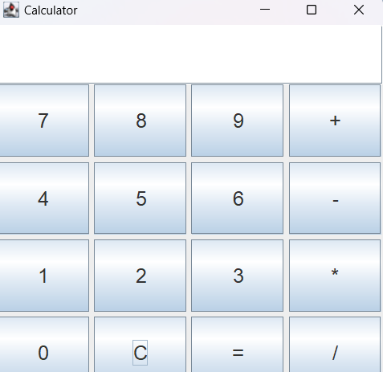

# Simple Calculator

This is a basic calculator application implemented in Java using Swing. It performs arithmetic operations including addition, subtraction, multiplication, and division. The application also features a clear button and a result display area.

## Features

- **Addition**: Performs addition of two numbers.
- **Subtraction**: Performs subtraction of two numbers.
- **Multiplication**: Performs multiplication of two numbers.
- **Division**: Performs division of two numbers with error handling for division by zero.
- **Clear Button**: Resets the calculator.
- **Result Display**: Shows the result of the calculation.

## Components

### `Calculator.java`

The main class that sets up the `JFrame` and integrates the calculator components.

### `CalculatorPanel.java`

A `JPanel` that includes:
- A text field for displaying results.
- Buttons for digits (0-9), arithmetic operations (`+`, `-`, `*`, `/`), clear (`C`), and equals (`=`).

### `CalculatorButton.java`

A custom `JButton` class for setting button size and font.

## Installation and Running

1. **Compile the Java Files**:

   Ensure you have Java installed and compile the Java files using:
   ```bash
   javac Calculator.java CalculatorPanel.java CalculatorButton.java
2. **Run the Application:**
   Execute the compiled Calculator class:
   ```bash
   java Calculator
  
## Usage
- **Enter Numbers**: Type numbers in the text fields.
- **Perform Operations**: Click on the desired arithmetic operation button (+, -, *, /).
- **Get Result**: Click the = button to see the result in the display area.
- **Clear Input**: Click the C button to reset the input fields and result

## screenshot


## Licence
This project is licensed under the MIT License - see the LICENSE file for details.
